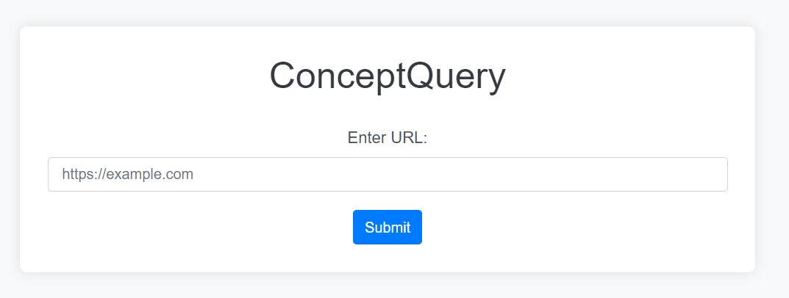
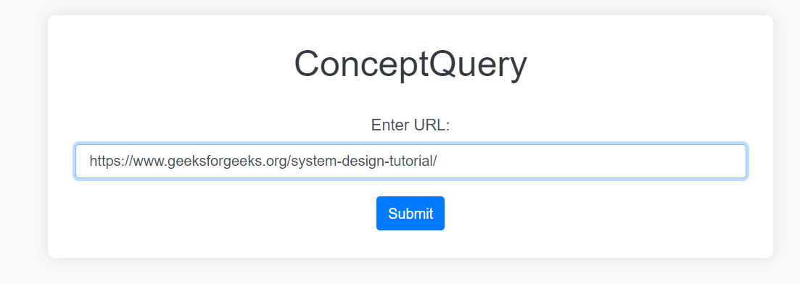
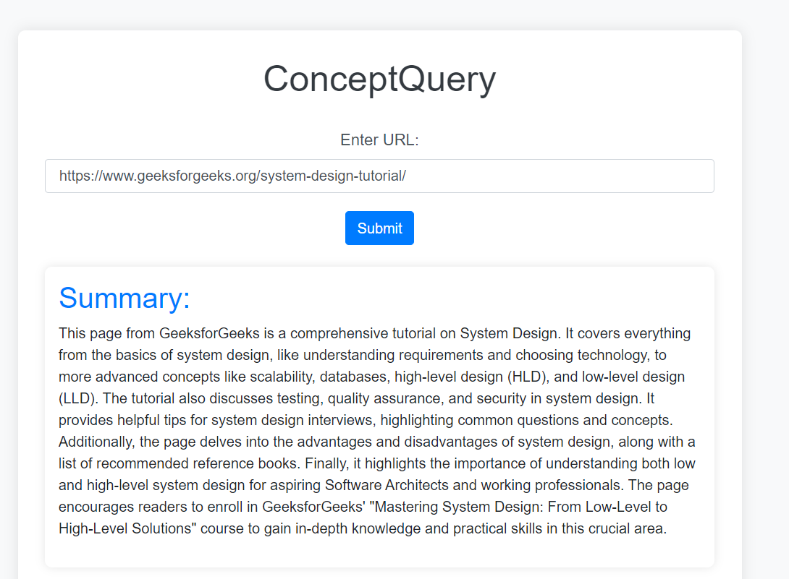
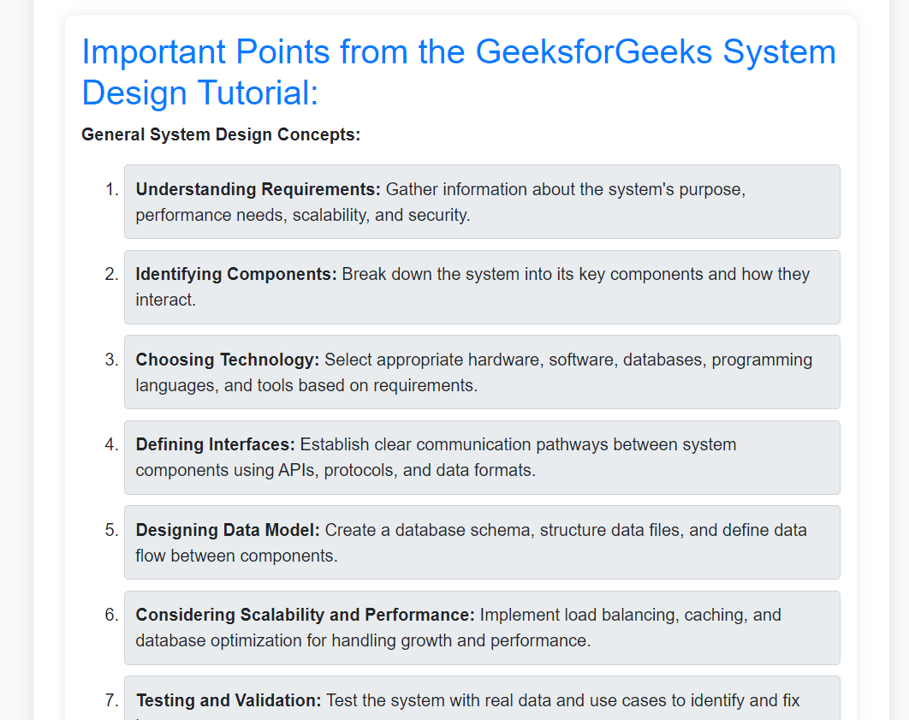

# ConceptQuery : Last-Minute Study Helper

## Overview

The ConceptQuery is a web application designed to assist students in quickly grasping the key points of an article or webpage. By leveraging **Firecrawl** for scraping and Google's Gemini for generating summaries and important questions, this tool makes studying more efficient, especially in the last-minute scenarios before exams.

## Features

- **URL Scraping with Firecrawl:** Extracts main content from the given URL, focusing on relevant information.
- **Summarization and Important Points Extraction:** Uses Google's Gemini model to generate concise summaries and highlight critical points from the content.
- **Markdown Rendering:** Presents the extracted information in a user-friendly format on the website.

## How It Works

1. **Input a URL:** Enter the URL of the article or webpage you want to summarize.
2. **Scrape Content:** Firecrawl extracts the main content from the provided URL.
3. **Process Content:** The extracted content is sent to Gemini, which generates a summary and lists important points.
4. **Display Results:** The results are displayed on the webpage in a clean and organized manner.

## Why This Project?

This tool was developed with students in mind, especially those who find themselves cramming for exams or needing to understand content quickly. It helps by:

- Providing quick summaries and key points.
- Reducing the time needed to read through long articles.
- Highlighting the most important aspects, allowing for more effective study sessions.

## How to Use

1. **Clone the Repository:**

   ```bash
   git clone https://github.com/itsdheerajdp/ConceptQuery.git
   cd ConceptQuery
   ```
2. **Install Dependencies:**
   ```bash
   pip install -r requirements.txt
   ```

3. **Set Up Environment Variables:**

   Create a `.env` file in the root directory and add your API keys:
   ```bash
   FIRECRAWL_API_KEY = your firecrawl api key
   GEMINI_API_KEY = your gemini api key
   ```

4. Run the Flask App:
   ```bash
   python app.py
   ```
5. Visit the Application:
   Open your web browser and navigate to `http://127.0.0.1:5000/` to use the app.


## How This Helps Students
- **Last-Minute Preparation**: Quickly understand the essence of lengthy content.
- **Efficient Study Sessions**: Focus on what truly matters, cutting down on time spent reading irrelevant information.
- **Better Retention**: Highlighted important points make it easier to recall information.

## Technologies Used
- **Python**: The core programming language.
- **Flask**: Web framework for developing the application.
- **Firecrawl**: For scraping web content.
- **Google Gemini**: For generating summaries and important questions.

## Screenshot

<p style="margin-bottom: 20px">
   
</p>


<br><br>



  
